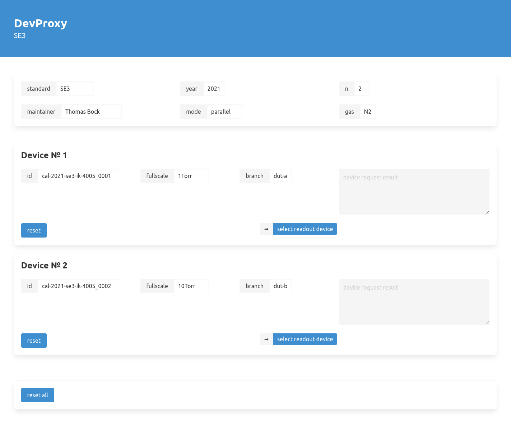

(**devproxy**) is a device proxy and interface written in [clojure](https://clojure.org/).

See documentation on [wactbprot.github.io](https://wactbprot.github.io/devproxy/)

```

 ┌───────────────────┐      ┌────────────────────────┐
 │                   ◄──────┤                        │
 │  DevProxy         │      │         Metis          │
 │                   ├──────►                        │
 └───┬───────────▲───┘      └───┬────────────────▲───┘
     │           │              │                │
 ┌───▼───────────┴──────────────▼────────────────┴────┐
 │                                                    │
 │   DevHub                                           │
 │                                                    │
 └───┬───────────▲──────────────┬────────────────▲────┘
     │           │              │                │
 ┌───▼───────────┴───┐       ┌──▼────────────────┴───┐
 │                   │       │                       │
 │  DUT              │       │    Standard           │
 │                   │       │                       │
 │ ┌───────────────┐ │       │   ┌───────────────┐   │
 │ │ TCP device    │ │       │   │ VXI11 device  │   │
 │ ├───────────────┤ │       │   ├───────────────┤   │
 │ ├───────────────┤ │       │   ├───────────────┤   │
 │ │ MODBUS device │ │       │   │ TCP device    │   │
 │ ├───────────────┤ │       │   ├───────────────┤   │
 │ ├───────────────┤ │       │   ├───────────────┤   │
 │ │ ...           │ │       │   │ MODBUS device │   │
 └─┴───────────────┴─┘       │   ├───────────────┤   │
                             │   ├───────────────┤   │
                             │   │ ...           │   │
                             └───┴───────────────┴───┘
```

## configuration

Default configurations are in `resources/conf.edn`. Some entries may be overwritten by environment variables:

* DEVPROXY_FACILITY (fallbacks: DEVHUB_FACILITY, METIS_FACILITY)
* DEVHUB_HOST
* DEVHUB_PORT
* REDIS_HOST
* COUCH_HOST


### tools.deps and tools.build

Build a stand alone app with:

```shell
clj -T:build clean
clj -T:build prep
clj -T:build uber
```

Run it with:

```shell
java -jar target/devproxy-x.y.z-standalone.jar
```

